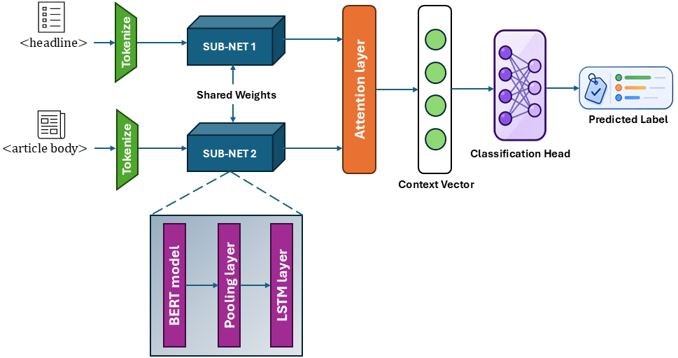
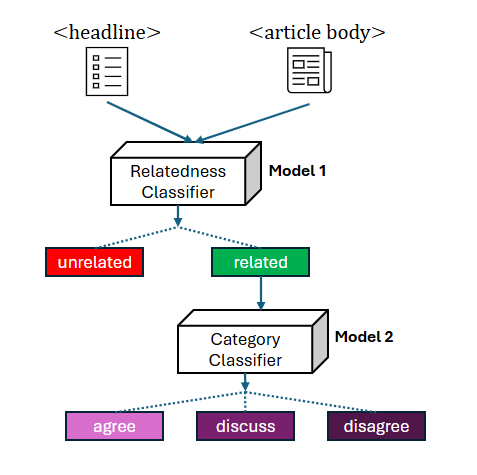

# Enhanced Stance Detection using Cascaded Siamese Networks with Attention Mechanism

This repository contains the code and dataset for **"Enhanced Stance Detection using Cascaded Siamese Networks with Attention Mechanism,"** published at the **31st International Conference on Neural Information Processing (ICONIP 2024)**.

The work addresses text-based stance detection using a cascaded Siamese network that decomposes the four-class Fake News Challenge (FNC-1) stance detection problem into two stages: relevance classification followed by stance classification.

The repository provides the implementation for reproducing the cascaded stance detection experiments reported in the paper.

---

## Methodology

The proposed framework decomposes stance detection into two sequential models:

1. **Model 1 — Relevance Classification** &mdash; determines whether a headline and article body are **related** or **unrelated**. The `agree`, `discuss`, and `disagree` classes are combined into the related class.
2. **Model 2 — Stance Classification** &mdash; classifies examples predicted as related into **agree**, **discuss**, or **disagree**.

Both models use Siamese BERT-based subnetworks with shared weights, followed by an LSTM and attention mechanism. Model 1 uses a sigmoid output for binary relevance classification, while Model 2 uses a softmax output for three-way stance classification.

The proposed Siamese network architecture is illustrated below:

<p align="center">
  
</p>

<p align="center">
  <em>Proposed Siamese network architecture. Model 1 uses a sigmoid classification head for binary relevance classification, whereas Model 2 uses a softmax classification head for three-way stance classification.</em>
</p>

The complete prediction pipeline is shown in the following figure:

<p align="center">
  
</p>

```

---

## Repository Structure

```text
StanceDetection/
├── assets/
│   └── framework.png
│
├── classification/
│   └── train_cascaded_siamese.py
│
├── data/
│   ├── competition_test_bodies.csv
│   ├── competition_test_stances.csv
│   ├── train_bodies.csv
│   └── train_stances.csv
│
├── .gitignore
├── LICENSE
├── requirements.txt
└── README.md
```

---

## Installation

Clone the repository:

```bash
git clone https://github.com/zainali93/StanceDetection.git
cd StanceDetection
```

The experiments use Python 3.11 and TensorFlow 2.15. A Conda environment is recommended for reproducing the software environment.

```bash
conda create -n stancedetection python=3.11
conda activate stancedetection
pip install -r requirements.txt
```

All commands below assume that they are executed from the root directory of the repository.

Training the Siamese models is computationally intensive, and a CUDA-enabled GPU is strongly recommended. TensorFlow will automatically use compatible GPU devices available in the environment.

---

## Dataset

The experiments use the **Fake News Challenge (FNC-1)** dataset for text-based stance detection.

The dataset contains headline–article body pairs belonging to four stance classes:

- `agree`
- `disagree`
- `discuss`
- `unrelated`

The official FNC-1 training and competition test files used by the experiments are included in the `data/` directory:

```text
data/
├── competition_test_bodies.csv
├── competition_test_stances.csv
├── train_bodies.csv
└── train_stances.csv
```

The original FNC-1 dataset and associated resources are available from the official repository:

[Fake News Challenge (FNC-1)](https://github.com/FakeNewsChallenge/fnc-1)

The released train and test partitions are retained as provided by FNC-1.

### Cascaded Label Construction

For **Model 1**, the four stance labels are converted into binary relevance labels:

```text
agree     -> related
discuss   -> related
disagree  -> related
unrelated -> unrelated
```

Due to the substantial class imbalance in FNC-1, the unrelated class is randomly undersampled to **25,000 examples** when training Model 1.

For **Model 2**, only related examples are retained:

```text
agree    -> 0
discuss  -> 1
disagree -> 2
```

---

## Cascaded Siamese Training

The complete training and evaluation pipeline can be run using:

```bash
python classification/train_cascaded_siamese.py
```

The script sequentially:

1. Loads and merges the official FNC-1 stance and article-body files.
2. Constructs the binary relevance dataset for Model 1.
3. Constructs the three-class related-stance dataset for Model 2.
4. Tokenizes headlines and article bodies separately.
5. Trains the binary relevance model.
6. Trains the three-class stance model.
7. Applies the two models sequentially to the official FNC-1 test set.
8. Reports class-wise performance, accuracy, and the FNC-1 evaluation score.

---

## Experimental Settings

Both stages use a frozen `bert-base-uncased` encoder with a shared LSTM and attention mechanism.

The common training configuration is:

| Parameter | Value |
|---|---|
| Pretrained model | `bert-base-uncased` |
| Headline maximum length | 15 |
| Article-body maximum length | 300 |
| LSTM units | 128 |
| Dropout | 0.5 |
| Batch size | 20 |
| Epochs | 100 |
| Learning rate | 2e-3 |
| Optimizer | Adam |
| Validation split | 20% |

Model 1 uses binary cross-entropy with a sigmoid output, while Model 2 uses categorical cross-entropy with a three-class softmax output.

Training is performed for the full 100 epochs. The weights corresponding to the lowest validation loss are restored at the end of training and used for evaluation.

The relevance classifier uses the threshold configured in the experimental pipeline to determine which examples are passed to Model 2.

---

## Evaluation

Evaluation is performed on the official FNC-1 competition test set.

The script reports:

- Precision, recall, and F1-score for each stance class
- Overall classification accuracy
- FNC-1 weighted score
- Normalized FNC-1 metric

The FNC-1 metric gives partial credit for correctly identifying whether a headline–article pair is related, with additional credit for predicting the correct stance among related examples.

---

## Reproducibility

Random seeds are fixed for NumPy and TensorFlow, and the random undersampling procedure uses a fixed seed.

The repository provides the cleaned implementation of the experimental pipeline used for the proposed cascaded Siamese approach. For additional details regarding the methodology, experimental setup, and reported results, please refer to the paper.

---

## Paper

The paper is available through Springer:

[Enhanced Stance Detection using Cascaded Siamese Networks with Attention Mechanism](https://link.springer.com/chapter/10.1007/978-981-96-6599-0_26)

**Muhammad Zain Ali, Tony Smith, and Bernhard Pfahringer.**  
Proceedings of the 31st International Conference on Neural Information Processing (ICONIP 2024).

---

## Citation

If you use this work, please cite:

```bibtex
@inproceedings{ali2024enhanced,
  title={Enhanced Stance Detection Using Cascaded Siamese Networks with Attention Mechanism},
  author={Ali, Muhammad Zain and Smith, Tony and Pfahringer, Bernhard},
  booktitle={International Conference on Neural Information Processing},
  pages={377--392},
  year={2024},
  organization={Springer}
}
```

---

## License

This project is released under the [MIT License](https://github.com/zainali93/StanceDetection/tree/master?tab=MIT-1-ov-file)
